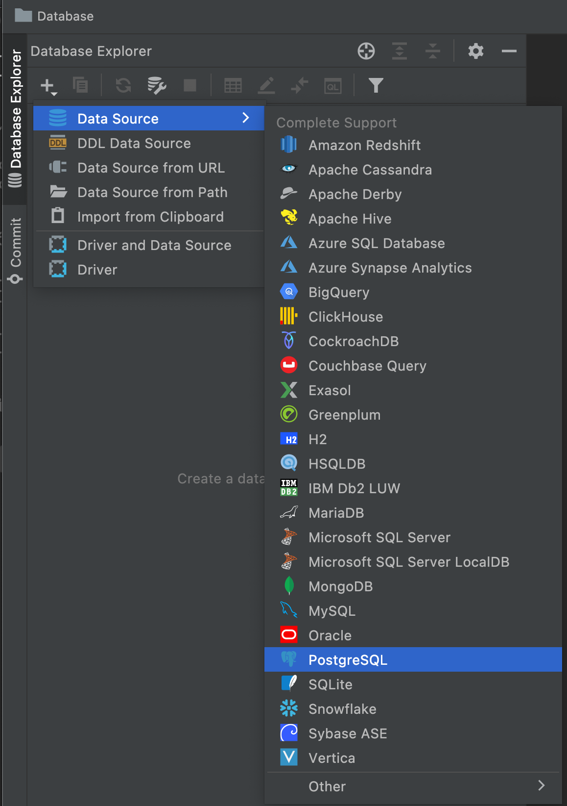
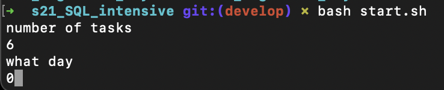

# s21_SQL_intensive
 Интренсив по работе с базами данных, состоящий из девяти индивидуальных и двух груповых дней, длился пару недель.
В работе использовал `Postgres` и `DataGrip`

если возникли проблемы с подключением, возможно стоит поменять порт.

В репозитории приствует скрипт `start.sh` который запрашивает сколько заданий создать и какой день интенсива

после чего будут созданы папки с файлами указанного дня.

| **Самое интересное находиться в папке check_list, там найдете решения для сверки ваших ответов** |
|----------------------------------------------------| 

##### так же настоятельно рекомендую самотоятельно разобраться с sql и быть внимательнее при написании скриптов

